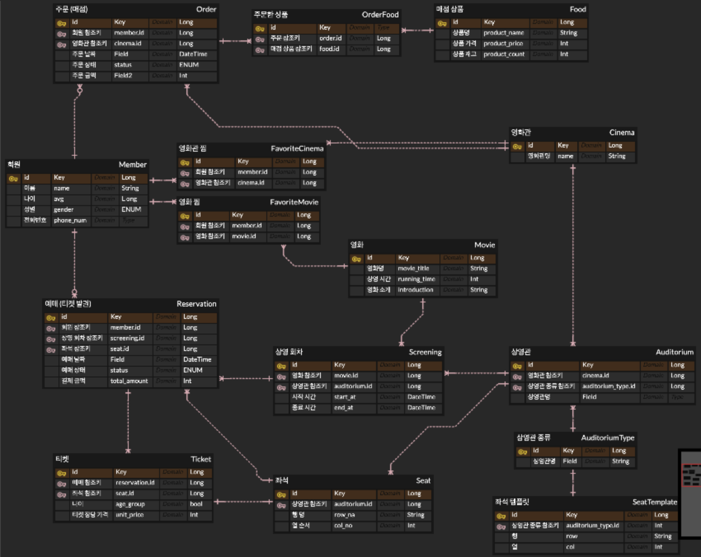

# 2주차

## ERD



## 기능 구현

- 영화관 조회
- 영화 조회
- 영화 예매/취소

## @Entity

**회원**:

**예매**:

**영화관**:

**영화**:

**매점**:

+FK, 연관관계 매핑

FK: 외래 키

+연관관계

- 다대일(N:1)
- 일대다(1:N)
- 일대일(1:1)
- 다대다(N:N)

+연관관계 주인 → FK 관리하는 쪽

+값타입(Value Type)

- 임베디드 타입

+공통

- name
- price
- stockQuantity

+ENUM 타입

→ 속성으로 꼭 (EnumType.STRING) 주자! 기본값 (ORDINARY) → 숫자로 매핑됨

+cascade 속성

? 하이버네이트가 엔티티 영속화할 때.. 컬렉션 → 내장 컬렉션 만듦

컬렉션 넣어둔 다음에 persist 날릴 때

(cascade = CascadeType.ALL) 속성 달아두면

persist(필드명) → 하나로 컬렉션 다 persist 처리 할 수 있음

+Lombok(롬복)

생성자 → 어노테이션 관리

@Getter @Setter

읽기 메서드 제공 /

### +어노테이션

- 기본
    - @Id  → PK
        - @GeneratedValue
- 컬럼명 지정
    - @Column(name = “  “) → PK 테이블 컬럼명 지정
    - @JoinColumn(name = “ “) → FK 테이블 컬럼명 지정 (연관관계 주인 쪽에)
- 연관관계 매핑
    - @ManyToOne → 다대일
    - @OneToMany → 일대다

    - 연관관계 상하관계 표시: mappedBy = ‘field’) 속성으로 주인 지정 (field)

      → 주인이 아닌 쪽은 읽기만 가능

    - 지연 로딩 (fetch = FetchType.LAZY) 어노테이션에 달아주기
- 임베디드 타입
    - @Embeddable → 값 타입 정의하는 곳에 표시
    - @Embedded → 값 타입 사용하는 곳에 표시

## JPARepository

- 영속성 컨텍스트 → 1차 캐시

- 멀티 스레드

## Domain - Repository 설계

### 1. 회원 도메인

Member

MemberService

⬆️

MemberServiceImpl ➡️ MemberRepository

                                              ⬆️

H2MemberRepository / JPAMemberRepository

### 2. 조회 도메인

Cinema / Auditorium

Movie

### 3. 예매/취소 도메인

                                                                              회원 저장소 역할

                                                                                           |  회원 조회

클라이언트 ————————→ 예매 서비스 역할 ———————

                                                                                           | 가격 정책

                                                                            가격 정책 역할 + 할인…?

ReservaitonService

⬆️                                   ⬆️  ➡️  MemberRepository

⬆️                                   ⬆️                   ⬆️

⬆️                                   ⬆️       JpaMemberRepository

ReservaitonServiceImpl ➡️  ➡️  ➡️ 

                                                     ⬇️

⬇️ ➡️ CountPolicy

⬆️

TicketCountPolicy

CountPolicy → 가격 정책

- 영화관 종류 (특별관 / 일반관)
- 매수 (선택좌석수)
- 연령 (어른/어린이)

- 연관관계 주인 (Member- Reservation) : Reservation

  -예매 리스트 조회 서비스 EX)


```java
@Service
@RequiredArgsConstructor
public class ReservationQueryService {
  private final ReservationRepository reservationRepository;

  public Page<ReservationDto> getMemberReservations(Long memberId, int page, int size) {
    var pageable = PageRequest.of(page, size, Sort.by("reservedAt").descending());
    return reservationRepository.findByMemberId(memberId, pageable)
            .map(ReservationDto::from);
  }
}
```

DTO

정적 팩토리 메서드를 사용해서 DTO 사용

## Integration / Unit Test

Global Exception를 만들어봐요

[https://adjh54.tistory.com/79](https://adjh54.tistory.com/79)

Swagger 연동 후 Controller 통합 테스트

Service 계층의 단위 테스트


## JWT

인증에 필요한 정보들을 암호화시킨 토큰, Access Token으로 사용되며 Header, Payload, Verify Signature 객체가 필요하다!

JWT 구성 요소

1. Header(JSON) : Signature를 해싱하기 위한 알고리즘 정보들이 담겨 있음
2. Payload(JSON) : 서버와 클라이언트가 주고받는, 시스템에서 실제로 사용될 정보에 대한 내용들을 담고 있음
3. Verify Signature : 토큰의 유효성 검증을 위한 문자열

⇒ Header, Payload는 인코딩 O 암호화 X → SECRET KEY 없이 복호화할 수 없는 Verify Signature 필요

⇒ 해커가 토큰을 훔쳐 Payload 데이터를 임의로 조작해서 서버로 보내도 Verify SIgnature은 사용자의 정보를 기반으로 암호화되므로, 서버에서 Verify Signature을 검사하는 과정에서 유효하지 않은 토큰으로 간주한다.

JWT 장점

- 중앙의 인증서버, 데이터 스토어에 대한 의존성 없음, 시스템 수평 확장 유리
- Base64 URL Safe Encoding → URL, Cookie, Header 모두 사용 가능

JWT 단점

- Payload의 정보가 많아지면 네트워크 사용량 증가, 데이터 설계 고려 필요
- 토큰이 클라이언트에 저장되므로, 서버에서 클라이언트의 토큰을 조작할 수 없음

### JWT Security 설정

- JWT 관련
    - TokenProvider: 유저 정보로 JWT 토큰을 만들거나 토큰을 바탕으로 유저 정보를 가져옴
    - JwtFilter: Spring Request 앞단에 붙일 Custom Filter
- Spring Security 관
    - JwtSecurityConfig: JWT Filter를 추가
    - JwtAccessDeniedHandler: 접근 권한 없을 때 403 에러
    - JwtAuthenticationEntryPoint: 인증 정보 없을 때 401 에러
    - SecurityConfig: 스프링 시큐리티에 필요한 설정
    - SecurityUtil: SecurityContext에서 전역으로 유저 정보를 제공하는 유틸 클래스
    - CorsConfig: 서로 다른 Server 환경에서 자원을 공유에 필요한 설정

# 로그인 인증 4가지 방식 요약

## 1) 세션 + 쿠키(Session ID)

**인증 순서**

1. 사용자 로그인 시도
2. 서버에서 사용자 정보 확인 후, 서버 세션 저장소에 사용자 상태 저장 및 Session ID 발급
3. 서버 HTTP 응답 헤더에 발급된 Session ID를 보냄. 이후 매 요청마다 서버 HTTP 응답 헤더로 Session ID가 담긴 쿠키 전달
4. 서버가 쿠키를 받아 세션 저장소에서 대조 후 대응되는 정보 전달
5. 인증 완료 및 서버 → 사용자 데이터 전달

**장단점**

- (장) 쿠키엔 의미있는 사용자정보 없음(키만 보관), 서버가 강제 무효화 용이, 구현 단순.
- (단) 세션 저장소 필요(스케일링 부담), 쿠키 탈취 시 하이재킹 위험(HTTPS, SameSite, 짧은 만료 필요).

---

## 2) JWT Access Token만 사용

1. 사용자 로그인 시도
2. 서버에서 사용자 정보 확인 후, 사용자의 고유한 ID 값 부여 및 Payload에 정보 전달
3. JWT 토큰의 유효기간 설정
4. SECRET KEY를 통해 암호화된 Access Token을 HTTP 응답 헤더에 실어 보냄
5. 사용자는 Access Token을 받아 저장, 인증이 필요한 요청마다 토큰을 HTTP 요청 헤더에 실어 보냄
6. 서버에서는 해당 토큰의 Verify Signature를 SECRET KEY로 복호화, 조작 여부 혹은 유효 기간 검증
7. 검증 완료되면 Payload를 디코딩하여 사용자의 ID에 맞는 데이터 전달

**장단점**

- (장) 세션 저장소 불필요, 마이크로서비스/게이트웨이에 적합, 수평 확장 용이.
- (단) 발급 후 만료 전 **강제 무효화가 어려움**(유출 리스크), Payload는 디코딩 가능 → **민감정보 금지**.

---

## 3) JWT Access Token + Refresh Token(권장)

Access Token의 유효기간을 짧게 하면 로그인을 자주해야해서 번거롭고, 길게 하면 보안이 취약해지므로 이를 해결하고자 나온 것이 Refresh Token!

1. 사용자가 로그인 시도
2. 서버에서 회원 DB에서 값을 비교
3. 로그인 완료 시 Access Token, Refresh Token을 발급하여 HTTP 응답 헤더에 실어 보내고, 일반적으로 회원 DB에 Refresh Token을 저장
4. Refresh Token은 사용자의 DB에 저장 후, Access Token을 HTTP 요청 헤더에 실어 요청을 보냄
5. Access Token을 검증하여 이에 맞는 데이터를 보냄
6. Access Token 만료 시 사용자는 이전과 동일하게 Access Token을 HTTP 요청 헤더에 실어 보냄
7. 서버가 Access Token이 만료됨을 확인하고 권한 없음을 신호로 보냄
8. 사용자가 Refresh Token과 Access Token을 HTTP 요청 헤더에 실어 보냄
9. 서버는 받은 Access Token이 조작되지 않았는지 확인한 후, HTTP 요청 헤더의 Refresh Token과 사용자의 DB에 저장되어 있던 Refresh Token을 비교, Token이 동일하고 유효기간도 지나지 않았다면 새로운 Access Token을 발급함
10. 서버는 새로운 Access Token을 HTTP 응답 헤더에 실어 다시 API 요청을 진행함

**장단점**

- (장) 유출 피해 범위 축소(Access 짧음), 사실상 무상태에 가까운 운영 + 통제지점 확보.
- (단) 구현 복잡, 재발급/회전 로직, Refresh 저장소 운영 필요.

---

## 4) OAuth 2.0 (Authorization Code, 소셜 로그인)

구글/카카오 등 외부 권한서버에서 사용자 인증·토큰을 받아와 우리 서비스 계정과 연동.

**장단점**

- (장) 소셜 계정으로 빠른 온보딩, 외부 자원 접근 위임 표준.
- (단) 리다이렉트/코드 교환 등 플로우 복잡, 제공자별 설정·검증 필요.


## 코드 리팩토링 (책임 분리)
참고) 
https://youtu.be/dJ5C4qRqAgA?si=WAgUBNGA9G_B8Vl0


객체 참조는 결합도가 가장 높은 의존성 -> 객체 참조를 끊어 결합도를 낮추자!


1. 의존성 설계 수정
@ManyToOne, @OneToMany 관계로 풀어낸 Entity 관계들 중    
결합도가 높을 필요가 없는 경우, Entity 참조 -> id 참조할 수 있도록 Entity 설계 수정       

2. Service layer 책임 분리    
ex) Member Domain Service
```    
@Service
@RequiredArgsConstructor
public class MemberReader {

    private final MemberRepository memberRepository;

    /** 회원 단건 조회 */
    public Member getById(Long memberId) {
        MemberEntity member = memberRepository.findById(memberId)
                .orElseThrow(() -> new IllegalArgumentException("회원을 찾을 수 없습니다. id=" + memberId));
        return Member.from(member);
    }
}
```    

```    
@Service
@RequiredArgsConstructor
public class MemberSaver {

    private final MemberRepository memberRepository;

    /** 회원 가입 */
    @Transactional
    public Long execute(CreateMemberCommand createMemberCommand) {  // member join command
        MemberEntity saved = memberRepository.save(createMemberCommand.toEntity());
        return saved.getId();
    }

}
```    

```   
@Service
@RequiredArgsConstructor
public class AuthService {

    private final MemberReader memberReader;
    private final MemberSaver memberSaver;
    private final PasswordEncoder passwordEncoder; // BCryptPasswordEncoder

    @Transactional
    public void signUp(SignUpRequest req) {
        // 이미 존재하는 loginId 체크
        memberReader.getByLoginId(req.loginId());

        // 새 회원 생성 (비밀번호는 반드시 암호화)
        CreateMemberCommand m = new CreateMemberCommand(
                req.name(),
                req.age(),
                req.gender(),
                req.loginId(),
                passwordEncoder.encode(req.password())
        );

        memberSaver.execute(m);

    }
}
```    

Controller가 참조하는 Service의 Repository 의존성을 없앨 수 있다!    


## [동시성 문제]

### 레이스 컨디션(Race Condition)    
여러 스레드가 공유 데이터에 동시에 접근하고 변경하려 할 때 발생하는 문제      
-> 한 개의 스레드만 접근 가능하도록 하자!   

```
@Test
public void 동시에_100개_요청() throws InterruptedException {
    int threadCount = 100;
    ExecutorService executorService = Executors.newFixedThreadPool(32);
    CountDownLatch latch = new CountDownLatch(threadCount);
    
    for (int i = 0; i < threadCount; i++){
        executorService.submit(() -> {
            try {
                stockService.decrease(1l,  1L);
            } finally {
                latch.countDown();
            }
        });
    }

}

```

### 해결 방법 
#### 1. synchronized
Spring에서 제공하는 기능. 메서드에 붙여주면, 해당 메서드에 한 개의 스레드만 접근 가능하다.   

```
@Service
@RequiredArgsConstructor
public class StockService {

    private final StockRepository stockRepository;
    
    @Transactional
    public synchrnoized void decrease (Long id, Long quantity){
        Stock stock = stockRepository.findById(id).orElseThrow();
        stock.decrease(quantity);
        
        stockRepository.save(stock);
    }
 
}
```  

그러나... @Transactional의 특성 때문에 동시성 문제가 여전히 해결되지 않는다...    
Transaction의 동작 과정을 들여다보자!    
```
@Service
@RequiredArgsConstructor
public class TransactionStockService {

    private final StockService stockService;
    
    public void decrease (Long id, Long quantity){
        startTransaction(); // Transaction 시작
        
        stockService.decrease(quantity); // stockService->decrease 메소드 실행
        
        endTransaction(); // Transaction 종료 -> stockRepository에 stock commit
    }
    
}
```  
stock.decrease 메서드에 'synchronized'를 붙여주었으므로, 해당 코드에 접근가능한 스레드는 '한 개'이댜.     
Transaction 자체에 접근한 A 스레드, B 스레드가 있다고 해보자.    
A 스레드가 endTransaction()을 호출하여 감소한 재고가 stockRepository에 반영되기 전,    
B 스레드가 stockService.decrease()를 호출할 수도 있다.    
이 경우 B 스레드는 갱신되기 전의 값을 가져가므로 이전과 동일한 문제가 발생한다.    

=> @Transactional 어노테이션을 제거하면 해결된다..    

서버를 여러 대 돌릴 때에도 synchronized로 해결이 될까?
-> sychronized는 process 단위로 접근을 제어하는 것.
다중 서버 환경에서는 결국 여러 스레드가 접근할 수 있게 된다.

#### 2. Database Lock
2-1. Pessimistic Lock (비관적 락) // row나 table 단위    
실제로 데이터에 Lock을 걸어서 정합성을 맞추는 방법. exclusive lock을 걸게되면 다른 트렌젝션에서는 
lock이 해제되기 전에 데이터를 가져갈 수 없게 된다. 충돌이 빈번하게 일어나는 경우에 좋다.
(문제점)     
-> 데드락이 걸릴 수 있다. 또한 별도의 락을 걸어주어야 하기 때문에 성능 이슈가 있다.       
```
public interface StockRepository extends JpaRepository<Stock, Long> {

    @Lock(LockModeType.PESSIMISTIC_WRITE)
    @Quey("select s from Stock s where s.id = :id")
    Stock fidnByIdWithPessimisticLock(Long id);
    
}

@Service
@RequiredArgsConstructor
public class PessimisticLockStockService {

    private final StockRepository stockRepository;
    
    @Transactional
    public void decrease (Long id, Long quantity){
        Stock stock = stockRepository.findByIdWithPessimisticLock(id);
        
        stock.decrease(quantity);
        
        stockRepository.save(stock);
    }
    
}
```  


2-2. Optimistic Lock (낙관적 락)    
실제로 Lock을 이용하지 않고 버전을 이용함으로써 정합성을 맞추는 방법. 먼저 데이터를 읽은 후에 update를 수행할 때   
현재 내가 읽은 버전이 맞는지 확인하여 업데이트 한다. 내가 읽은 버전에서 수정사항이 생겼을 경우에는 application에서 다시 읽은 후에 작업을 수행해야 한다.    

1. Server1 (version = 1) -> Mysql (version = 1) // success
```  
update set version = version + 1, quantitiy = 2,
from stock
where id = 1 and version = 1
```  
2. update ->  Mysql (version = 2)
3. Server2 (version = 1) -> Mysql (version = 2) // fail
```  
update set version = version + 1, quantitiy = 2,
from stock
where id = 1 and version = 1
```

Entity에 version 컬럼 추가 (@Version 어노테이션)
```
public interface StockRepository extends JpaRepository<Stock, Long> {

    @Lock(LockModeType.OPTIMISTIC)
    @Quey("select s from Stock s where s.id = :id")
    Stock fidnByIdWithOptimisticLock(Long id);
    
}

@Service
@RequiredArgsConstructor
public class OptimisticLockStockService {

    private final StockRepository stockRepository;
    
    @Transactional
    public void decrease (Long id, Long quantity){
        Stock stock = stockRepository.findByIdWithOptimisticLock(id);
        
        stock.decrease(quantity);
        
        stockRepository.save(stock);
    }
    
}

@Component
public class OptimisticLockStockFacade {
    private final OptimisticLockStockService optimisticLockStockService;
    
    public void decrease (Long id, Long quantity){
        while (true) {
            try {
                optimisticLockStockService.decrease(id, quantity);
                break;
            } catch (Exception e) {
                Thread.sleep(50);
            }
        }
    }

}
```  


2-3. Named Lock // metadata 단위    
이름을 가진 metadata locking이다. 이름을 가진 lock을 획득한 후 해제할 때까지 다른 세션이 해당 lock을 획득할 수 없도록 한다.    
(문제점)
-> transaction이 종료될 때 lock이 자동으로 해제되지 않으므로, 별도의 명령어로 해제를 수행해주거나   
선점시간이 끝나야 해제된다.


#### 3. Redis
3-1. Lettuce
- setnx 명령어를 활용하여 분산락 구현
- spin lock 방식

3-2. Redisson
- pub-sub 기반으로 Lock 구현 제공
Thread 1 -- 락 해제 메세지 --> Channel -- 락 획득 시도 요청 메시지 --> Thread 2


## 7주차    

### 트랜잭션 전파 속성    

#### *- 스프링에서 트랜잭션을 관리하는 방법*

Spring의 @Transactional 어노테이션은 여러 트랜잭션을 묶어 하나의 트랜젝션 경계를 만들 수 있게 해준다.
이때 트랜잭션을 어떻게 처리할 지에 대해 스프링이 제공하는 속성이 전파 속성 (Propagation)이다.    

    
스프링에서는 트랜잭션을 '물리 트랜잭션'과 '논리 트랜잭션'으로 나누어 처리한다.       

- 물리 트랜잭션    
  실제 데이터베이스에 적용되는 트랜잭션으로 커넥션을 통해 커밋/롤백하는 단위
- 논리 트랜잭션
  스프링이 처리하는 트랜잭션 영역을 구분하기 위해 만들어진 개념    

[트랜잭션 원칙]
1. 모든 논리 트랜잭션이 커밋되어야 물리 트랜잭션이 커밋된다
2. 하나의 논리 트랜잭션이라도 롤백되면 물리 트랜잭션은 롤백된다


#### *-트랜잭션 전파 속성*


1. REQUIRED    
   -> Default 속성. 미리 시작된 트랜잭션이 있으면 참여하고 없으면 트랜잭션을 생성한다.
      부모 메서드와 자식 메서드가 하나의 트랜잭션으로 묶여 동작한다. 하나의 트랜잭션으로 묶이기 때문에 부모나
      자식에서 예외가 발생하면 전체 트랜잭션이 롤백된다.      

2. SUPPORTS    
   -> 이미 시작된 트랜잭션이 있으면 참여하고 없으면 트랜잭션 없이 진행한다. 트랜잭션이 없긴 하지만 해당 경계 안에서
      Connection이나 Hibernate Session 등을 공유할 수 있다.       

3. MANDATORY     
   -> REQURIED와 비슷하며, 이미 시작된 트랜잭션이 있으면 참여한다. 하지만 트랜잭션이 없다면 생성하는 것이 아니라
      예외를 발생시킨다. 혼자서 독립적으로 트랜잭션을 실행하면 안되는 경우에 사용한다.       

4. REQUIRES_NEW     
   -> 항상 새로운 트랜잭션을 시작한다. 이미 진행 중인 트랜잭션이 있다면, 트랜잭션을 보류시킨다.
      부모 트랜잭션과 자식 메서드의 트랜잭션이 완전히 분리되어 동작한다. 자식 메서드의 트랜잭션이 완료되면
      부모 트랜잭션이 다시 활성화된다. 부모와 자식 트랜잭션이 서로 독립적이므로 하나가 실패하더라도 다른 하나는
      영향을 받지 않는다.        

5. NOT_SUPPORTED
   -> 트랜잭션을 사용하지 않게 한다. 이미 진행 중인 트랜잭션이 있으면 보류시킨다.     

6. NEVER
   -> 트랜잭션을 사용하지 않도록 강제한다. 이미 진행 중인 트랜잭션도 존재하면 안되며, 트랜잭션이 있다면 예외를 발생시킨다.

7. NESTED
   -> 이미 진행중인 트랜잭션이 있으면 중첩 트랜잭션을 시작한다. 중첩된 트랜재션은 먼저 시작된 부모 트랜잭션의
      커밋과 롤백에는 영향을 받지만, 자신의 커밋과 롤백은 부모 트랜잭션에게 영향을 주지 않는다. 

*7-1. 부모 트랜잭션의 롤백이 NESTED 속성을 가진 자식에게 전파될 때*
``` java
// AService
@Transactional
public void saveWithNestedParentException(Member aMember, Member bMember) {
    memberRepository.save(aMember);
    bService.saveWithNestedParentException(bMember);
    throw new RuntimeException();
}
 
 
// BService
@Transactional(propagation = Propagation.NESTED)
public void saveWithNestedParentException(Member bMember) {
    memberRepository.save(bMember);
}
 
 
// Test Code
@Test
@DisplayName("[NESTED] 부모 트랜잭션의 롤백이 자식에게 전파")
public void saveWithNestedParentExceptionTest() {
    Member aMember = new Member(1L);
    Member bMember = new Member(2L);
 
    assertThatThrownBy(() -> aService.saveWithNestedParentException(aMember, bMember))
        .isInstanceOf(RuntimeException.class);
 
    assertThat(memberRepository.findAll()).size().isEqualTo(0);
}

```  
부모 트랜잭션에서 예외가 터지면 자식 트랜잭션도 함께 롤백된다.

*7-2. NESTED 속성을 가진 자식 트랜잭션이 롤백될 때*

``` java
// AService
@Transactional
public void saveWithNestedChildException(Member aMember, Member bMember) {
    memberRepository.save(aMember);
    try {
        bService.saveWithNestedChildException(bMember); // 중첩 트랜잭션
    } catch (RuntimeException e) {
        System.out.println("중첩 트랜잭션 롤백 처리: " + e.getMessage());
    }
}
 
 
// BService
@Transactional(propagation = Propagation.NESTED)
public void saveWithNestedChildException(Member bMember) {
    memberRepository.save(bMember);
    throw new RuntimeException();
}
 
 
// Test Code
@Test
@DisplayName("[NESTED] 자식 트랜잭션의 롤백이 부모에게 전파되지 않음")
public void saveWithNestedChildExceptionTest() {
    Member aMember = new Member(1L);
    Member bMember = new Member(2L);
 
    aService.saveWithNestedChildException(aMember, bMember);
 
    assertThat(memberRepository.findAll()).size().isEqualTo(1);
}
```  
자식의 트랜잭션과는 무관하게 부모 트랜잭션에서 저장한 aMemer가 커밋된다.

### 인덱스 종류     

인덱스 타입은 크게 **Primary(클러스터) 인덱스**와 **Secondary(보조) 인덱스**로 나뉘어 진다.    
클러스터 인덱스는 '영어 사전'처럼 처음부터 정렬이 되어 있는 것이고, 보조 인덱스는 '책 뒤의 찾아보기'와 같은 것이다.

| 구분 | 클러스터 인덱스 (Clustered Index) | 보조 인덱스 (Secondary / Non-Clustered Index) |
|------|------------------------------------|-----------------------------------------------|
| **속도** | 빠르다 | 느리다 |
| **사용 메모리** | 적다 | 많다 |
| **인덱스 구조** | 인덱스가 주요 데이터 | 인덱스가 데이터 사본(Copy) |
| **개수 제한** | 테이블당 1개 | 여러 개 가능(최대 ~250개) |
| **리프 노드** | 리프 노드 자체가 데이터 | 리프 노드는 데이터 위치(포인터) 저장 |
| **저장값** | 데이터 자체가 저장됨 | 값 + 데이터의 위치 포인터 |
| **정렬 방식** | 인덱스 순서 = 물리적 저장 순서 | 인덱스 순서 ≠ 물리적 저장 순서 |


#### 1. 클러스터 인덱스
- 한 개의 테이블에 한 개씩만 만들 수 있다.
- 특정 나열된 데이터들을 일정 기준으로 정렬해주는 인덱스이며, 해당 인덱스가 생성될 때 데이터 페이지 전체가
다시 정렬된다.
- MySQL에서는 Primary Key가 있다면 Primary Key를 클러스터 인덱스로 지정한다.
  - Primary Key를 지정하지 않은 경우 -> UNIQUE하면서 NOT NULL인 컬럼을 클러스터 인덱스로 지정한다.
  - UNIQUE로 지정한 컬럼도 없는 경우 -> 자동으로 유니크한 값을 가지도록 증가되는 컬럼(GET_CLUST_INDEX)를
    내부적으로 생성 후 클러스터 인덱스로 지정한다.

#### 2. 세컨더리 인덱스
- 세컨더리 인덱스는 데이터 테이블과 별개로 정렬된 인덱스 페이지를 생성하고 관리한다. 비클러스터형 인덱스나
  보조 인덱스라고 불린다.    


세컨더리 인덱스는 데이터에 접근하려면 **인덱스 페이지에서 데이터 페이지로 이동하여 실제 데이터 레코드를 가져오는
과정이 추가** 된다.

#### 3. 커버링 인덱스
- 원하는 데이터를 인덱스에서만 추출할 수 있는 인덱스
- 쿼리를 만드는 SELECT / WHERE / GROUP BY / ORDER BY 등에 활용되는 모든 컬럼이 인덱스여야 한다.


참고: https://jay-ya.tistory.com/166    
ex) 상품 테이블의 데이터 레코드 수가 대략 1700만 건이 존재하며, 이 테이블을 대상으로 특정 조건에 맞게
페이지네이션 하는 경우     


product_id(Primary Key)와 delivery 컬럼에 인덱스가 걸려 있는 상태

```  mysql
select * 
from product 
where delivery like '초고속 배송%' 
limit 5000000, 10
```  
실행결과: 10 rows in set (1 in 18.28 sec)    

커버링 인덱스 적용 시 >

```  mysql
select product_id, delivery 
from product 
where delivery like '초고속%' 
limit 5000000, 10;
```  
실행결과: 10 rows in set (3.60 sec)   

커버링 인덱스를 적용할 경우, 실 데이터에 액세스하는 시간이 없어지기 때문에 조회 쿼리에
낭비되는 시간 없이 데이터를 완성할 수 있다.


### 성능 최적화    

- 인덱스 대상 컬럼 선정    
    카디널리티가 높은 컬럼, 즉 중복도가 나증 컬럼을 우선적으로 인덱싱하는 것이 좋다.    
    ex-1) 남 - 여 2가지 값만 존재하는 성별 컬럼의 경우, 중복도가 높으므로 카디널리티가 낮다.    
    ex-2) 주민번호 컬럼은 중복도가 낮기 때문에 카디널리티가 높다.    


1. 회원 가입 시 중복 아이디를 확인하는 경우    

```  java
@Entity
@Table(
name = "member",
uniqueConstraints = @UniqueConstraint(name = "uk_member_login_id", columnNames = "login_id")
)
@Getter @NoArgsConstructor(access = AccessLevel.PROTECTED)
public class MemberEntity {

    @Id @GeneratedValue(strategy = GenerationType.IDENTITY)
    @Column(name = "member_id")
    private Long id;

    // ...

    private String loginId;

    // ...
}
```  

@UniqueConstraint로 Table에서 unique를 걸어주거나, @Column에서 unqiue=true를 걸어주면
DB에 unique index가 생긴다.

```  sql
create table member
(
age       int                     not null,
member_id bigint auto_increment
primary key,
login_id  varchar(30)             not null,
name      varchar(50)             not null,
password  varchar(255)            not null,
gender    enum ('FEMALE', 'MALE') null,
constraint uk_member_login_id
unique (login_id)
);
```  

*기존 회원 아이디 중복 여부 조회하던 로직*
```  java
public boolean getByLoginId(String loginId) {
    Optional<MemberEntity> member = memberRepository.findByLoginId(loginId);
    // ..
}
```
이 경우 스프링 JPA는 아래와 같은 쿼리를 날린다
``` sql
select * 
from 
    member 
where 
    login_id = ?
```


*리팩토링*
``` java
public interface MemberRepository extends JpaRepository<MemberEntity, Long> {

    boolean existsByLoginId(String loginId);
}
```

``` java
/** 회원 아이디 중복 여부 조회 */
public boolean isDuplicateLoginId(String loginId) {
    return memberRepository.existsByLoginId(loginId);
}
```

스프링 JPARepository exist() 메서드는 첫 row만 찾으면 즉시
종료되며, login_id에 unique index가 걸려있으므로 효율적으로 조회가 가능하다.
``` sql
select
    1 as col_0_0_
from
    member
where
    login_id = ?
limit 1;
```


2. 예매 시 조회가 많은 상영관에 대해서도 unique 컬럼 추가

``` java
@Entity @Table(name = "auditorium",
uniqueConstraints = @UniqueConstraint(name="uk_cinema_name", columnNames = {"cinema_id","name"}))
@Getter @NoArgsConstructor(access = AccessLevel.PROTECTED)
public class Auditorium {
    // ...
}
```

3. 예매 내역 조회 시, 한 달 내 예매 내역을 우선 조회할 수 있도록 member_id, reserved_at 컬럼 인덱싱

``` java
@Entity
@Table(
name = "reservation",
indexes = {
@Index(name = "idx_member_reserved_at", columnList = "member_id, reserved_at")
}
)
@Getter
@NoArgsConstructor(access = AccessLevel.PROTECTED)
public class Reservation {
    // ...
}
```
조회 쿼리 형태
``` sql
select *
from 
    reservation
where 
    member_id = ?
        and reserved_at >= ?
order by reserved_at desc;
```