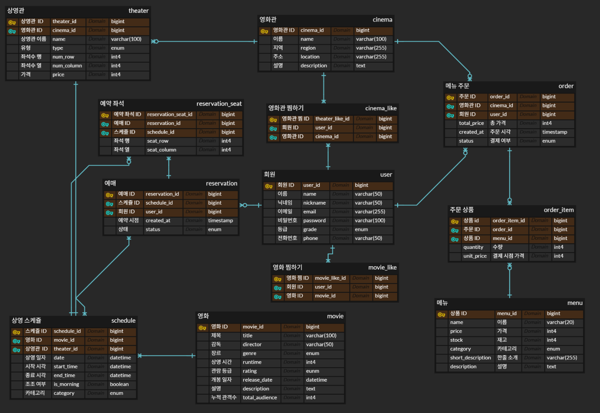

# spring-cgv-22nd
## CEOS 22기 백엔드 스터디 - CGV 클론 코딩 프로젝트
**영화관 예매 및 주문 시스템**을 구현하기 위한 데이터베이스 구조를 설계하였습니다.  
주요 기능은 영화관 탐색, 영화 탐색, 상영 스케줄 확인, 유저의 예매 및 주문, 찜하기입니다.



---

## 📦 테이블 구조

### 1. 영화관 (cinema)
- `cinema_id` (PK): 영화관 고유 ID
- `name`: 영화관 이름
- `region`: 지역
- `location`: 주소
- `description`: 영화관 상세 설명  

- 다른 테이블과의 관계는 아래와 같습니다.  
  ➡️ **1 (cinema) : N (theater)**  
  ➡️ **1 (cinema) : N (order)**  
  ➡️ **1 (cinema) : N (theater_like)**

---

### 2. 상영관 (theater)
- `theater_id` (PK)
- `cinema_id` (FK → cinema)
- `name`: 상영관 이름
- `type`: 상영관 유형 (2D, 3D, IMAX, 4DX 등)
- `row`, `column`: 좌석 행/열
- `price`: 기본 좌석 가격  
- 다른 테이블과의 관계는 아래와 같습니다.  
  ➡️ **1 (theater) : N (schedule)**

---

### 3. 영화 (movie)
- `movie_id` (PK)
- `title` : 영화 제목
- `director` : 감독
- `genre`: 영화 장르
- `runtime`: 상영 시간
- `rating`: 관람 등급
- `release_date`: 개봉일
- `description`: 설명
- `total_audience`: 누적 관객 수 
- 다른 테이블과의 관계는 아래와 같습니다.  
  ➡️ **1 (movie) : N (schedule)**  
  ➡️ **1 (movie) : N (movie_like)**

---

### 4. 상영 스케줄 (schedule)
- `schedule_id` (PK)
- `movie_id` : 상영되는 영화의 id
- `theater_id` : 상영관 id
- `date`, `start_time`, `end_time`: 상영 일자 및 시간
- `is_morning`: 조조 여부
- `category`: 카테고리 (오전, 오후, 18시 이후, 심야)  
- 다른 테이블과의 관계는 아래와 같습니다.  
  ➡️ **1 (schedule) : N (reservation)**

---

### 5. 회원 (user)
- `user_id` (PK)
- `name`, `nickname`, `email`, `password`
- `grade`: 회원 등급
- `phone`: 전화번호  
- 다른 테이블과의 관계는 아래와 같습니다.  
  ➡️ **1 (user) : N (reservation)**  
  ➡️ **1 (user) : N (order)**  
  ➡️ **1 (user) : N (theater_like)**  
  ➡️ **1 (user) : N (movie_like)**

---

### 6. 예매 (reservation)
- `reservation_id` (PK)
- `schedule_id` : 예매한 영화 스케쥴 id
- `user_id` : 예약자 id
- `created_at`: 예약 시간
- `status`: 상태 (예매 완료, 취소)  
- 다른 테이블과의 관계는 아래와 같습니다.  
  ➡️ **1 (reservation) : N (reservation_seat)**

---

### 7. 예약 좌석 (reservation_seat)
- `reservation_seat_id` (PK)
- `reservation_id` : 예약 정보 id
- `schedule_id` : 예약된 영화 스케쥴 id
- `row`, `column`: 예약 좌석 위치

---

### 8. 메뉴 (menu)
- `menu_id` (PK)
- `name`: 상품 이름
- `price`: 가격
- `stock`: 재고
- `category`: 메뉴가 속한 카테고리 (콤보, 음료, 팝콘, 스낵, 굿즈)
- `short_description`, `description`: 메뉴 1줄 소개, 메뉴 설명  
- 다른 테이블과의 관계는 아래와 같습니다.  
  ➡️ **1 (menu) : N (order_item)**

---

### 9. 메뉴 주문 (order)
- `order_id` (PK)
- `cinema_id` : 주문이 이루어진 영화관 id
- `user_id` : 주문자 id
- `total_price`: 총 금액
- `created_at`: 주문 시각
- `status`: 결제 여부 (결제 대기, 결제 완료)
- 다른 테이블과의 관계는 아래와 같습니다.  
  ➡️ **1 (order) : N (order_item)**

---

### 10. 주문 상품 (order_item)
- `order_item_id` (PK)
- `order_id` : 주문 id
- `menu_id` : 주문 메뉴 id
- `quantity`: 수량
- `unit_price`: 결제 시점 단가

---

### 11. 영화관 찜하기 (cinema_like)
- `cinema_like` (PK)
- `user_id` : 유저 id
- `cinema_id` : 영화관 id  
- 다른 테이블과의 관계는 아래와 같습니다.  
  ➡️ **N:M** (user ↔ cinema)

---

### 12. 영화 찜하기 (movie_like)
- `movie_like_id` (PK)
- `user_id` : 유저 id
- `movie_id` : 영화 id   
- 다른 테이블과의 관계는 아래와 같습니다.  
  ➡️ **N:M** (user ↔ movie)

---

# 인증(Authentication) 방법 정리

## 1. 세션(Session) & 쿠키(Cookie) 인증

### 인증 흐름
1. 사용자가 로그인 요청을 보냅니다.
2. 서버는 사용자 정보를 확인한 뒤 **세션 ID**를 생성하고 세션 저장소에 기록합니다.
3. 서버는 Session ID를 쿠키에 담아 클라이언트로 전달합니다.
4. 클라이언트는 이후 요청마다 쿠키(Session ID)를 포함시킵니다.
5. 서버는 세션 저장소와 대조해 사용자를 확인하고 데이터를 반환합니다.

### 장점
- 실제 정보는 서버에 저장, 쿠키는 **세션 키(출입증)** 역할만 함 → 보안성 상대적으로 우수
- 매번 회원 정보를 확인하지 않아도 되므로 인증 속도가 빠름

### 단점
- 쿠키 탈취 시 **세션 하이재킹 공격** 발생 가능 → HTTPS + 세션 만료 시간 설정 필요
- 세션 저장을 위해 **서버 자원(메모리/DB 등)** 필요

---

## 2. JWT 기반 인증 (Access Token)

### 구조
- **Header**: 토큰 타입(JWT), 알고리즘(HS256 등)
- **Payload**: 사용자 ID, 권한, 만료시간 등 Claims
- **Signature**: 위·변조 방지용 서명 (Header + Payload + Secret Key 기반)

### 인증 흐름
1. 사용자가 로그인 요청을 보냅니다.
2. 서버는 사용자 정보를 확인 후 JWT(Access Token)를 생성합니다.
3. 클라이언트는 Access Token을 전달받아 저장합니다.
4. 이후 요청마다 `Authorization: Bearer <token>` 헤더에 토큰을 담아 전송합니다.
5. 서버는 토큰의 유효성(서명, 만료시간)을 확인 후 데이터를 반환합니다.

### 장점
- 서버 저장소가 불필요하고 **무상태(stateless)** 구조에 적합합니다.
- 다른 서비스와의 연동이 용이합니다.

### 단점
- 만료 전까지 강제 무효화 어렵습니다. (탈취 시 위험)
- Payload는 누구나 디코딩 가능하여 민감 정보 저장이 불가능합니다.
- 토큰 크기가 커서 요청 많을 시 트래픽 비용 증가합니다.

---

## 3. Access Token + Refresh Token 인증

### 개념
- **Access Token**: 짧은 유효기간(예: 1시간), API 요청시 인증/인가에 사용
- **Refresh Token**: 긴 유효기간(예: 2주), Access Token이 만료되었을 때 재발급 용도로 사용

### 인증 흐름
1. 로그인 성공 시 서버는 Access Token과 Refresh Token을 발급합니다.
2. 클라이언트는 Access Token을 요청에 포함하여 보냅니다.
3. Access Token이 만료되면 Refresh Token을 이용해 새로운 Access Token을 발급받습니다.
4. Refresh Token까지 만료되면 재로그인이 필요합니다.

### 장점
- Access Token을 짧게 가져가므로 탈취당해도 보안에 취약한 시간을 줄일 수 있습니다.
- 사용자는 자주 로그인할 필요가 없어 편리합니다.

### 단점
- 구현 복잡도가 올라갑니다.
- Access Token의 유효기간이 매우 짧은 경우 서버 부하 증가가 예상되며 매 API 호출마다 accessToken을 이용한 인증 부하가 발생합니다.

---

## 4. OAuth 2.0 인증

### 개념
- 외부 서비스(Google, Facebook 등) 계정을 사용해 인증을 위임받는 프로토콜
- 현재 표준은 **OAuth 2.0**입니다.

### 주요 참여자
- **Resource Owner**: 사용자
- **Client**: 우리의 애플리케이션
- **Authorization Server**: 인증/토큰 발급 서버
- **Resource Server**: 보호된 자원을 가진 서버

### 인증 흐름
1. 사용자가 Client에 로그인 요청
2. Client는 사용자를 Authorization Server(구글/페북 로그인 페이지 등)로 리디렉트
3. 사용자가 로그인 후 **Authorization Code**를 Client로 전달
4. Client는 Authorization Server에 Authorization Code를 전송해 **Access/Refresh Token** 발급
5. Client는 Access Token으로 Resource Server에 요청
6. 토큰 만료 시 Refresh Token으로 갱신

### 장점
- 소셜 로그인, 외부 계정 연동에 많이 활용되어 범용성이 높은 방법입니다.
- 표준화된 방식으로 다양한 서비스에서 실제로 활용하는 인증 방법입니다.

### 단점
- 설정이 복잡(redirect URI, client ID/secret 필요)하여 초기 구현 비용이 높습니다.
- 토큰 보관 및 만료 처리에 주의 필요합니다.

---

## 5. SNS 로그인 (Facebook, Google 등)

### 인증 흐름
1. 사용자가 서버에 로그인 요청
2. 서버는 SNS 로그인 URL을 클라이언트로 전달
3. 사용자가 해당 URL을 통해 로그인 → 인증 코드 반환
4. 서버는 Authorization Server에 코드 검증 요청 후 Access/Refresh Token + 사용자 정보 발급
5. 서버는 사용자 정보를 DB에 저장(신규면 회원가입, 기존이면 로그인)
6. 이후 인증은 세션/쿠키 또는 JWT 방식으로 관리  

---

## 동시성 문제

동시성 문제는 여러 프로세스(또는 스레드)가 동시에 공유 자원(메모리, 파일, 소켓 등)에 접근하면서 발생하는 오류를 말합니다.

대표 개념:
- **Race Condition**
  - 실행 순서에 따라 결과가 달라지는 현상
- **데이터 불일치**
  - 동시에 데이터를 수정할 때 일관성이 깨지는 문제
- **Deadlock(교착 상태)**
  - 서로가 가진 자원을 기다리며 무한 대기
- **Starvation(기아 상태)**
  - 특정 스레드가 자원을 계속 못 받아 굶주리는 상황
- **원자성(Atomicity) 문제**
  - 여러 연산이 한 덩어리로 수행돼야 하는데 중간에 끼어들어 일관성이 깨지는 문제

---

### OS 과목에서 제시하는 해결법

#### 1. 스핀락(Spinlock)
- 자원이 풀릴 때까지 CPU를 돌면서 계속 확인
- 짧은 임계 구역에서 유용

#### 2. 뮤텍스(Mutex)
- 상호 배제(Mutual Exclusion)용 잠금
- 한 번에 한 스레드만 임계 구역 진입 가능

```c
// Peterson's Algorithm (2-프로세스 상호배제 예시)

i, j : process IDs (i ≠ j)
flag : boolean array    // 각 프로세스가 임계 구역에 들어가고 싶은지 여부
turn : integer          // 누구 차례인지

repeat
  flag[i] := true;   // i가 임계 구역 원함
  turn := j;         // j에게 우선권 양보

  while (flag[j] == true and turn == j) do no-op; 
  // j도 임계 구역 원하고, 지금은 j 차례면 기다린다.

  critical section

  flag[i] := false;  // i가 임계 구역 사용 종료

  remainder section
until false;
```

#### 3. 세마포어(Semaphore)
- 공유 자원에 접근 가능한 개수를 관리하는 카운터 기반 동기화 도구

```c
type semaphore = record
    value : integer;          // 현재 사용 가능 자원 수
    L : queue of process;     // 대기 중인 프로세스 큐
end;

// 입장 요청
wait(S : semaphore) :
    S.value := S.value - 1;
    if S.value < 0 :
        add this process to S.L;
        block this process;
    end;

// 퇴장 처리
signal(S : semaphore) :
    S.value := S.value + 1;
    if S.value <= 0 :
        remove a process P from S.L;
        wakeup(P);
    end;
```

#### 4. 모니터(Monitor)
- 언어/런타임 차원에서 임계 구역 보호를 캡슐화한 고수준 동기화 구조
- 공유 자원 접근을 안전하게 직렬화

---

## Spring에서 동기화 문제 해결법

### 1. `synchronized`

특정 메서드 또는 블록을 한 번에 하나의 스레드만 실행하게 하는 방법.

```java
@Service
public class StockService {

    public synchronized void decreaseStock(Long menuId, int qty) {
        // 재고 조회 -> 검증 -> 차감 -> 저장
        // 이 메서드에 진입한 스레드가 끝나기 전까지
        // 다른 스레드는 대기합니다.
    }
}
```

- 스프링 빈은 기본적으로 싱글톤이므로, 단일 서버 환경에서는 유효함
  - 소규모 / 로컬 / 관리자용 툴 수준 서비스에서 유용
- 한계: **멀티 인스턴스(분산 환경)** 에서는 인스턴스마다 락이 따로라서 동시성 문제가 여전히 발생

---

### 2. DB Lock

DB의 락 기능을 활용해서 동시성 제어.

#### 2.1 비관적 락 (Pessimistic Lock)

- 수정할 레코드에 아예 락을 걸고 다른 트랜잭션을 대기시키는 방식
- `SELECT ... FOR UPDATE` 등으로 구현
- 트랜잭션이 끝날 때까지 다른 트랜잭션은 대기 또는 타임아웃

```java
public interface MenuRepository extends JpaRepository<Menu, Long> {

    @Lock(LockModeType.PESSIMISTIC_WRITE) // Hibernate -> SELECT FOR UPDATE
    @QueryHints({
        @QueryHint(
            name = "jakarta.persistence.lock.timeout",
            value = "2000" // ms 단위 예: 2초 기다리다 못 잡으면 예외
        )
    })
    @Query("""
        select m from Menu m
        where m.menuId in :ids
        order by m.menuId asc
    """)
    List<Menu> findAllForUpdateOrderByIdAsc(@Param("ids") Collection<Long> ids);
}
```

- 특징
  - 트랜잭션이 유지되는 동안 레코드가 잠김
  - 아주 강력하게 정합성을 보장
- 단점
  - 경합이 높은 상황에서 병목/지연
  - 여러 레코드를 잠글 때 순서를 통일하지 않으면 데드락 위험
  - 사용자 대기 시간이 긴 흐름(결제 화면 등)에는 부적합

---

#### 2.2 낙관적 락 (Optimistic Lock)

- 엔티티에 `@Version` 필드를 두고 버전 번호를 비교
- 커밋 시점에 `where id=? and version=?` 으로 UPDATE
- 버전이 안 맞으면 예외 → 충돌 감지

```java
@Entity
public class Menu {

    @Id
    private Long menuId;

    private Integer stock;

    @Version
    private Long version;
}
```

```java
@Transactional
public void decreaseStock(Long menuId, int qty) {
    Menu menu = menuRepository.findById(menuId)
        .orElseThrow();

    if (menu.getStock() < qty) {
        throw new IllegalStateException("재고 부족");
    }

    menu.setStock(menu.getStock() - qty);
    // 트랜잭션 커밋 시 version 비교
    // version이 바뀌었으면 ObjectOptimisticLockingFailureException 발생
}
```

- 장점
  - DB row-level 락을 오래 안 잡는다 → 데드락 위험 적음
  - 사용자 대기 중인 긴 트랜잭션에도 적합
- 단점
  - 충돌 시 예외 처리 후 **재시도 로직**이 필요
  - 경합이 심하면 재시도가 너무 잦아질 수 있음

---

#### 2.3 Named Lock

- DB가 제공하는 "이름 기반"의 논리 락
  - 예: MySQL `GET_LOCK('seat:123', timeout)` / `RELEASE_LOCK('seat:123')`
- 특정 키에 대해 동시에 한 세션만 진입하게 제어
- Redis 없이도 "분산 락 비슷한 것"을 DB만으로 구현 가능

주의:
- DB가 락 관리까지 담당하므로 DB 병목이 발생할 수 있음
- 락의 획득/해제 라이프사이클을 명확히 설계해야 함

---

### 3. Redis 기반 락

Redis를 분산 환경 전체에서 공통으로 사용하는 **전역 락 저장소**로 활용.

#### 3.1 Lettuce 방식

- `SET key value NX EX ttl` 형태로 락을 획득 (`NX`: 없을 때만 세팅, `EX`: 만료)
- 성공 시 현재 스레드가 락 보유
- 임계 구역 수행 후 `DEL key`로 해제
- 실패 시 반복적으로 시도(spin) → Redis 부하 가능
- 구현 단순, 빠름

#### 3.2 Redisson 방식

Redisson은 Redis 위에서 고수준 분산 락 API(`RLock`)를 제공.

```java
@Service
@RequiredArgsConstructor
public class OrderService {

    private final RedissonClient redissonClient;

    public void processOrder(Long orderId) throws InterruptedException {
        RLock lock = redissonClient.getLock("lock:order:" + orderId);

        // tryLock(waitTime, leaseTime, timeUnit)
        boolean locked = lock.tryLock(2, 5, TimeUnit.SECONDS);
        // 최대 2초 동안 락을 기다리고,
        // 성공하면 5초짜리 lease 시간으로 락을 보유

        if (!locked) {
            throw new IllegalStateException("다른 요청이 처리 중입니다");
        }

        try {
            // 임계 구역
            // (예: 재고 차감, 결제 상태 업데이트 등)
        } finally {
            lock.unlock();
        }
    }
}
```

- 장점
  - pub/sub 기반으로 불필요한 busy-wait(스핀) 없이 분산 락 구현
  - 여러 인스턴스 간 전역 1명만 통과시키는 구조 가능
- 단점
  - "락을 잡았다" ≠ "DB 정합성 자동 보장"
    - 임계 구역 안에서 여전히 DB 재고 검증 등은 직접 해야 함

---

## 결제 시스템(외부 연동) 설계 및 동작

### 외부 결제 연동

- 결제 서버: `https://payment.loopz.co.kr`
- 사용 API
  - 결제 생성: `POST /payments/{paymentId}/instant`
  - 결제 취소: `POST /payments/{paymentId}/cancel`
  - 단건 조회: `GET /payments/{paymentId}`
- 인증 방식
  - `Authorization: Bearer {SECRET_KEY}`
  - `application.yml`에 설정
- 구성
  - `PaymentApiService` (RestClient) → 외부 API 호출
  - `PaymentService` → 도메인 로직 오케스트레이션

---

### PaymentId 규칙

- 형식: `{STORE_ID}_NNNN`
  - 예: `CEOS-22-STOREID_0001`
- 고유성 보장: `payment_log.payment_id`에 Unique 제약

---

### 데이터 모델(PaymentLog)

주요 필드:
- `paymentId`
- `orderName`
- `totalAmount`
- `currency`
- `pgProvider` (예: `CEOS_PAY`)
- `category` (`Reservation` | `SNACK`)
- `paymentStatus` (`PAID` | `CANCELLED` | `FAILED`)
- `paidAt`

연관관계:
- `Reservation` 또는 `Order` 와 다대일(ManyToOne)

---

### 결제 생성 플로우(createPayment)

공통 시나리오:
1. 결제 대상이 예매(Reservation)인지 스낵(Order)인지 판별
2. 결제 요청 데이터 구성
  - `orderName`
  - `totalPayAmount`
  - `currency`
3. 외부 결제 API 호출
4. 응답으로 `paidAt` 등 결제 결과 수신

#### (1) 예매(Reservation) 결제
- 성공 시
  - `PaymentLog`를 `PAID` 상태로 저장
  - `Reservation.confirm()` 호출로 예매 확정
- 내부 처리 중 오류 발생 시
  - 외부 결제를 즉시 취소
  - 취소 로그 저장
  - `Reservation.cancel()` 수행 권장

#### (2) 스낵(Order) 결제
- 동시성 제어
  - 결제 직전, 주문에 포함된 메뉴 ID들을 정렬한 뒤  
    `Pessimistic Lock (SELECT ... FOR UPDATE)`으로 일괄 잠금
- 재고 차감
  - 각 메뉴에 대해 `decreaseQuantity(quantity)`
- 성공 시
  - `Order.pay()`
  - `PaymentLog`를 `PAID` 상태로 저장
- 오류/보상 처리
  - **재고 부족**
    - 외부 결제 취소
    - 취소 로그 저장
    - `Order.cancel()`
    - 클라이언트에 `409 CONFLICT`
  - **락 경합/타임아웃**
    - 외부 결제 취소
    - 취소 로그 저장
    - `Order.cancel()`
    - 클라이언트에 `423 LOCKED`

---

### 결제 취소 플로우(cancelPayment)

1. 외부 결제 취소 API 호출 성공
2. 내부 상태 롤백

내부 처리:
- `PaymentLog.cancel()`로 상태 업데이트
- 결제 종류별 처리
  - Reservation 결제
    - `Reservation.cancel()`
  - SNACK(Order) 결제
    - 재고 복구
      - 메뉴들을 다시 Pessimistic Lock으로 잠그고  
        `increaseQuantity()` 수행
    - `Order.cancel()`

추가로,
- 재고 복구는 별도의 트랜잭션 (예: `REQUIRES_NEW`)에서 처리
- 최대 3회 재시도 (짧은 백오프)
- 모두 실패하면 `423 LOCKED` 반환

---

### 결제 조회 플로우(getPayment)

1. 내부 `PaymentLog`에서 `paymentId` 조회
2. 외부 단건 조회 API(`GET /payments/{paymentId}`) 호출
3. 결과를 응답으로 반환

---

## 동시성 제어 전략 요약

### 1) 예매(Reservation) 좌석

- 타이밍: 좌석 선점 / 예매 확정 직전
- 방법: **Redisson 기반 분산 락**
  - 락 키 예시:
    - `lock:schedule:{scheduleId}:row:{row}:col:{col}`
  - 동일 좌석 동시 요청 중 하나만 성공
  - 실패한 요청은 타임아웃 후 포기
- DB 보강
  - `(schedule_id, row, column)`에 유니크 제약을 걸어 이중 방어

---

### 2) 스낵 주문(SNACK / Order) 재고

- 타이밍: 결제 순간 (최종 확정 직전)
- 방법: **DB Pessimistic Lock**
  - `findAllForUpdateOrderByIdAsc(ids)`
    - 메뉴 ID를 정렬된 순서로 잠가 데드락 위험 완화
- 성공 시
  - `decreaseQuantity()`로 재고 차감
  - 결제 성공 → `Order.pay()`
- 취소 시
  - 재고 복구는 별도 트랜잭션에서
  - Pessimistic Lock + `increaseQuantity()`
  - 최대 3회 재시도

---

## 로깅 전략

### 로깅 가이드

- **INFO**
  - 정상 비즈니스 이벤트
  - 예: 결제 생성/취소 성공, 예약 확정/취소 완료
- **WARN**
  - 클라이언트 기인 문제 / 도메인 규칙 위반
  - 예:
    - 400 잘못된 요청
    - 404 미존재
    - 409 재고 부족
    - 423 락 경합
    - 401/403 인증·인가 실패
- **ERROR**
  - 서버 내부 오류 / 외부 연동 실패 / 예기치 못한 예외
  - 주로 5xx 응답에 해당

---

## GlobalExceptionHandler 기반 예외 처리 정책 (ControllerAdvice)
- 예외를 한 곳에서 받아 표준화된 에러 응답(`ErrorResponse`)으로 변환
- 상태코드 / 에러코드 / 메시지를 일관되게 제공
- 내부 로그에는 상세 원인을 남기되, 클라이언트 응답은 안전한 표준 메시지만 노출

#### 주요 처리 흐름

1. **ResponseStatusException**
  - HTTP 상태코드를 사내 `ErrorCode`로 매핑
    - 예:
      - 400 → `BAD_REQUEST_ERROR`
      - 401 → `UNAUTHORIZED_ERROR`
      - 403 → `FORBIDDEN_ERROR`
      - 404 → `NOT_FOUND_ERROR`
      - 405 → `METHOD_NOT_ALLOWED_ERROR`
      - 기타 → `INTERNAL_SERVER_ERROR`
  - 로그 레벨: `warn`
  - 응답: `ErrorResponse.fromErrorCode(ErrorCode)`

2. **Validation / 바인딩 계열**
  - `MethodArgumentNotValidException`, `ConstraintViolationException` 등
  - 로그 레벨: `warn` (잘못된 필드/메시지 요약)
  - 응답: `400 BAD_REQUEST_ERROR`

3. **보안 계열**
  - `AuthenticationException` → 401
  - `AccessDeniedException` → 403
  - 로그 레벨: `warn`
  - 응답: 표준 `ErrorResponse`

4. **그 외 처리되지 않은 예외 (`Exception`)**
  - 로그 레벨: `error` + stacktrace
  - 응답: `500 INTERNAL_SERVER_ERROR`

---

